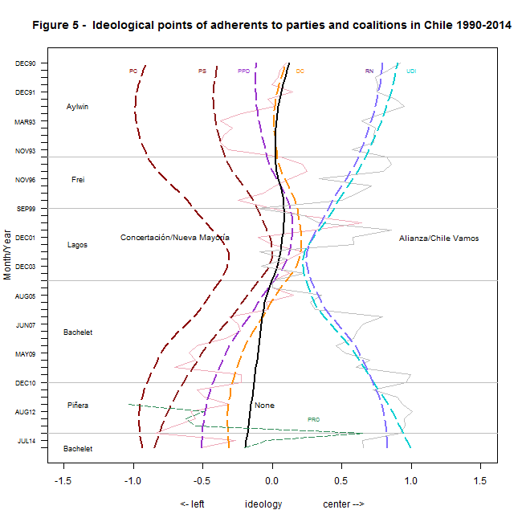
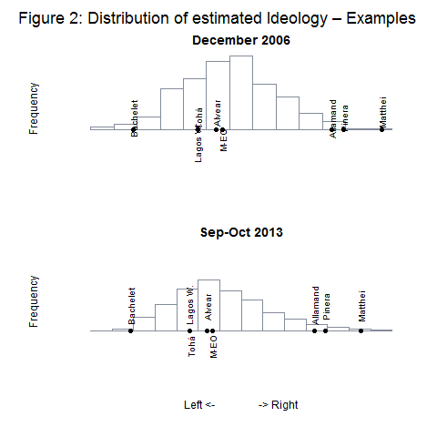

```{r setup, include=FALSE}
knitr::opts_chunk$set(echo = TRUE)
```

## Polarización en la Opinión Pública Chilena

Chile experimentó una convergencia en la opinión publica desde el retorno a la democracia en 1990 hasta mediados de la década del 2000 en un período que algunos analistas denominan la "Democracia de los Consensos". Posteriormente, un proceso de sistemática polarización (tendencia a la agrupación de las preferencias ideológicas en polos opuestos) se ha instalado en la opinión pública. En esta página encontrará material complementario a dos artículos en los que hemos sintetizado nuestra investigación de este proceso social que sigue profundizándose en Chile. Los artículos son los siguientes:

1) "Polarization and Electoral Incentives: The End of the Chilean Consensus Democracy, 1990–2014"  https://doi.org/10.1017/lap.2018.41

2) "La Fragilidad de los consensos: Polarización ideológica en el Chile post Pinochet" Revista de Ciencia Politica (forthcoming)

La dinámica de la polarización en el Chile contemporáneo se resume en la siguiente figura que aparece en "Polarization and Electoral Incentives":



## Los datos

La fuente original de los datos analizados en estos estudios son las encuestas de opinión pública del Centro de Estudios Públicos (CEP) desde 1990 al 2017. Las encuestas pueden ser bajadas gratuitamente en el siguiente link: https://www.cepchile.cl/cep/site/tag/port/all/tagport_1619_1.html

Del conjunto de preguntas de los cuestionarios CEP, este estudio descansa principalmente en el análisis de las respuestas a las preguntas de evaluación de personajes públicos debido a que es un tipo de preguntas que está presente en todas las encuestas desde 1990 a la fecha. En estas preguntas, los encuestados son invitados a indicar si tienen una percepción positiva o negativa (en una escala de cinco alternativas) respecto de un listado de actores políticos. Algunos actores políticos se repiten a través de las encuestas, pero otros sólo son incluidos en algunas ocasiones.

## El método

### La intuición básica
El centro del análisis consiste en estimar la ideología latente que explicaría la distribución de las respuestas dadas por los encuestados. El supuesto fundamental en el que descansa la estimación es que, en promedio, las personas tienden a entregar mejores valoraciones de los actores políticos que tienen posiciones ideológicas más parecidas a las suyas (en relación a sus valoraciones de actores políticos con posturas ideológicas más alejadas a las suyas). 

Por ejemplo, supongamos que se le pide a tres encuestados A, B y C que evalúen a tres políticos X, Y y Z en una escala donde 1 significa "Evaluación muy positiva" y 5 significa "Evaluación muy negativa". Supongamos que sus respuestas son las siguientes:

```{r tabla, include=FALSE}
require(kableExtra)
c <- matrix(c(1,3,5,
              3,3,3,
              5,3,1),nrow=3,ncol=3)
c <- as.data.frame(c)
row.names(c) <- c("Encuestado A", "Encuestado B", "Encuestado C")
colnames(c) <- c("Político X", "Político Y", "Político Z")
```
```{r print tabla, include=TRUE, echo=FALSE}
kable(c) %>% 
  kable_styling(latex_options="scale_down")
```

De acuerdo a la tabla, el encuestado 2 tienen la misma opinión respecto de los tres políticos, los otros dos encuestados coinciden en relación al político Y, pero manifiestan opiniones contrarias respecto de los otros dos candidatos. Si estas opiniones se explican ideológicamente, entonces, el encuestado B debería estar entre medio de los otros dos encuestados.

¿Cómo saber si las estimaciones tienen validez externa? Una forma de evaluar si son consistentes o no las estimaciones de ideología obtenidas para los encuestados es inferir las posiciones ideológicas que, a partir de sus evaluaciones, deberían tener los políticos evaluados. Ello porque las posturas relativas de los actores políticos si son de conocimiento público. Es decir, la estimación de las posturas ideológicas de los encuestados será razonable si en base a esas evaluaciones, los políticos de izquierda y centro izquierda son clasificados a la izquierda de los políticos de derecha y centro derecha. Los gráficos siguientes muestran ejemplos de las posiciones ideológicas de actores políticos estimadas a partir de estos supuestos en dos encuestas de la serie. Las posiciones relativas de los actores políticos son consistentes con lo que debería esperarse de acuerdo a sus posturas políticas. 



### La implementación práctica
En total se utilizadon cerca de 80.000 observaciones para estimar las posiciones ideológicas. En el artículo $Polarization$ $and$ $Electoral$ $Incentives$ la estimación se realizó mediante el paquete $emIRT$ de R y en el caso de $La$ $Fragilidad$ $de$ $los$ $Consensos$ el análisis se realizó en base al paquete $basicspace$ de R. Ambos paquetes están disponibles en CRAN (https://cran.r-project.org/web/packages/rstan/index.html)

Ambas técnicas de estimación generan resultados similares. 

### Los análisis

Una vez generadas las estimaciones de ideología para cada encuestado en cada encuesta, se procedió a filtrar a los encuestados según sus otras respuestas. Por ejemplo, en el caso del artículo $Polarization$ $and$ $Electoral$ $Incentives$ el foco de interés es la adhesión o no a partidos políticos; en cambio en $La$ $Fragilidad$ $de$ $los$ $Consensos$ el análisis se focalizó en características sociodemográficas. 

Si tienes una consulta, comentario o sugerencia, por favor, escribir a jfabrega at udd dot cl
